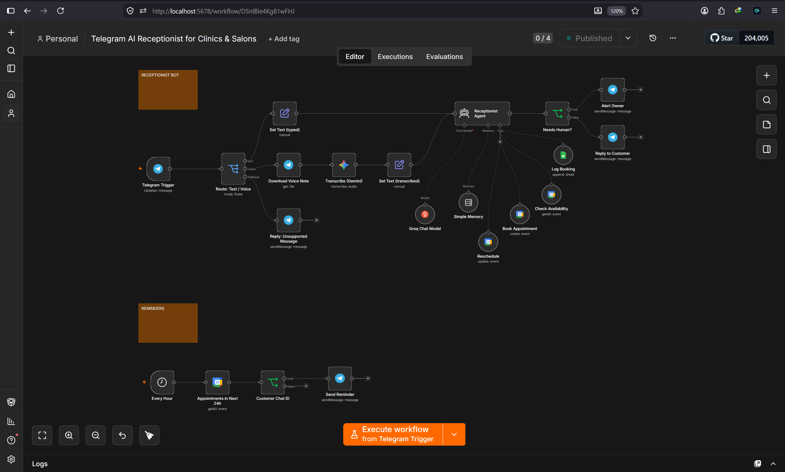

# Telegram AI Receptionist for Clinics & Salons
*n8n · Telegram · Google Gemini · Groq · Google Calendar · Google Sheets*

> Books, reschedules and reminds appointments 24/7 from a Telegram chat, with voice-note support and human handoff.

**Try it:** https://t.me/myfirstairesponder (live when my server is on; message me for a demo)

## Problem
Clinics and salons lose bookings because nobody answers messages after hours, and staff spend hours on back-and-forth scheduling.

## What it does
- Understands text **and voice notes** (Gemini transcription)
- Calls `check_availability` on a live Google Calendar before offering slots
- `book_appointment` creates the event; `reschedule` moves it; `log_booking` writes a row to Google Sheets
- Hands off to a human (`HANDOFF:`) when a request is outside its scope, alerting the owner on Telegram
- Separate hourly workflow sends reminders 24h before each appointment

## How it works
Telegram Trigger → Switch (text / voice / fallback) → Gemini transcription for voice → AI Agent (Gemini 2.5 Flash, per-user memory, 4 tools) → If (needs human?) → Telegram reply or owner alert. Reminder workflow: Schedule → Calendar Get Many → If (has chat id) → Telegram.

## Files
- `workflow.json` – main receptionist workflow
- `screenshots/` – proof of each feature

## Run it yourself
1. Import both JSON files into n8n (⋯ → Import from File).
2. Add credentials: Telegram bot token, Google Gemini API key, Groq API key,  Google Calendar OAuth2, Google Sheets OAuth2.
3. Create a Google Sheet `Bookings` with columns `date, time, name, chat_id, service, status`.
4. Edit the System Message with your business name, services and hours.
5. Publish both workflows.

## Problems I solved
- Telegram "can't parse entities" from Markdown in AI replies → HTML parse mode + stripped formatting
- Text and voice branches producing differently named fields → unified `text` field before the agent
- Agent handing off instead of using tools → explicit tool list and rules in the prompt
- Model inventing past dates → injected current date/time into the system prompt via expression
- Stale tool-call in memory breaking every run → session key reset and stable model choice

## Swap to WhatsApp
Replace Telegram Trigger with WhatsApp Trigger and the send nodes with WhatsApp Business Cloud; use the phone number as the session key. Nothing else changes.
